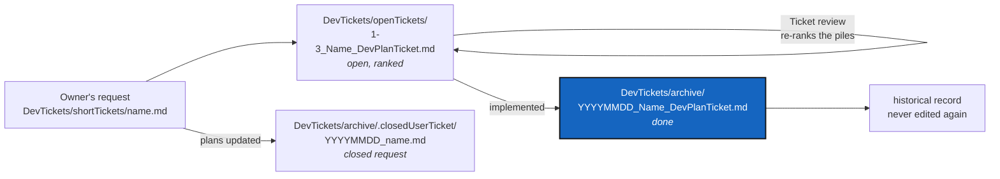

# Planning Ticket Lifecycle

*Created: 2026-09-03*

## Abstract — read this first

**The one-line version.** An open planning ticket is named for its
priority and its place in the queue — `1-3_Name_DevPlanTicket.md` — and
lives in `DevTickets/openTickets/`. When its work is implemented, that
prefix is replaced by a `YYYYMMDD_` calendar stamp — the date the
implementation landed — and the file moves to `DevTickets/archive/`.

**What this document is.** The naming and filing rules for planning
tickets: `DevPlan*.md`, `DevPlanTicket*.md`, `CorPlan*.md`, and anything
else that plans work rather than describing how the code works.

**Why it exists.** A ticket's filename is the only signal most readers
ever see. Without a rule, "is this still open?" can only be answered by
reading the whole document and then guessing, and "which one do I pick up
next?" can only be answered by reading all of them. Two prefixes answer
both from the filename alone, and neither can rot: one records a date that
already happened, the other is rewritten on purpose whenever the order
changes.

**What you will find.** Two states and the one transition between them,
where `DevTickets/` lives and why it is private, the priority-and-rank
prefix an open ticket carries, the optional topic prefix that marks a
workstream, the branch line every ticket states inside it, what the date
stamp means, the commit messages a finished ticket owes, the short tickets
plans are made from, and what the rule does *not* cover.

**Who it is for.** Anyone — human or agent — who writes, ranks, or
finishes a ticket.

**What you need to do with it.** Give every new ticket a prefix when you
create it (§2) and a branch line inside it (§3). Stamp and move it as part
of the commit that implements it (§5), not as a later tidy-up, and deliver
a commit message for every repository that changed (§5.1). Close the short
ticket it came from in the same change (§6).



---

## 1. The two states

| State | Where it lives | Filename |
|---|---|---|
| **Open** — planned, in progress, or partly done | `DevTickets/openTickets/` | ranked: `<priority>-<rank>_[<topic>-]<Name>_DevPlanTicket.md` |
| **Implemented** — the work described is done | `DevTickets/archive/` | stamped: `<YYYYMMDD>_<Name>_DevPlanTicket.md` |

There is no third state. A ticket that turns out to be wrong, or that is
superseded by another, is archived the same way — the stamp records when
it stopped being live work, and the document itself says why.

`DevTickets/` holds those two directories, `shortTickets/` for the
requests plans are made from (§6), and a `README.md` saying how the three
work together. Nothing else, and no ticket sitting loose at that level —
that is a filing mistake, not a state.

### 1.1 Where `DevTickets/` lives

`DevTickets/` is the planning surface of one project, and it is **private**:
it is the record of how the work is decided, which is nobody's business but
the people doing it. A project that mounts a private configuration
repository keeps it there — in ComplexGitSync, `.localSpec/DevTickets/` —
so that installing or cloning the product does not hand a user sixty
internal plans, most of them about work that was dropped.

Each project's own spec says where its `DevTickets/` sits. Everything below
is written as `DevTickets/…` and means "wherever that project put it".

## 2. The prefix an open ticket carries

```
DevTickets/openTickets/<priority>-<rank>_<Name>_DevPlanTicket.md
```

**`<priority>` is `1` or `2`.** Nothing else is a valid priority.

| Priority | Meaning |
|---|---|
| `1` — **prioritary** | Work to pick up now. A red build, a data-loss path, a wrong answer the user acts on, or something explicitly asked for. |
| `2` — **stand-by** | Real work, correctly analysed, not now. Large designs, speculative proposals, and small polish that nothing is waiting on. |

**`<rank>` is the ticket's position in its own priority's pile**, counted
from 1. The two piles are numbered independently, so `1-4` and `2-4` both
exist; the priority digit decides between them first, and the rank only
orders tickets within one pile.

Counting per pile rather than across both is what keeps the rank short: a
pile must reach ten tickets before the rank needs two characters, and a
pile that long is itself the problem to fix. When it happens, `1-10` is
correct and needs no new rule.

### 2.1 How the numbers change

1. **On creation**, a ticket is appended to the end of its pile: its rank
   is that pile's current length plus one. Nothing is renumbered, and the
   author does not have to argue for a position.
2. **On a Ticket review**, both piles are re-ranked by priority and
   importance, tickets move between piles, and the ranks are compacted so
   each pile runs 1..N with no gaps. This is the only thing that changes a
   rank, and it is expected to happen often.

A rank is a current judgement, not a commitment or a delivery order. A
ticket ranked `2-5` is not bad work: `2` is a scheduling claim, not a
quality one.

### 2.2 Referring to a ticket from another document

Because ranks move, **name a ticket by its short name in prose** —
`AppendCloneMode`, not `1-2_AppendCloneMode_DevPlanTicket.md`. A ranked
filename written into running text is wrong at the next review, and
nothing will tell you.

Write the full ranked path only in an actual Markdown link, where a
reader clicks it and a broken one is visible. Those are the paths the
`grep` in §5 is there to catch.

### 2.3 The topic prefix, when a group of tickets is one workstream

```
DevTickets/openTickets/<priority>-<rank>_<topic>-<Name>_DevPlanTicket.md
```

Several tickets sometimes form one line of work that is developed
together — usually on a branch of its own — and the reader needs to see
that from the filename, before opening anything. Those tickets take a
short **topic prefix** between the rank and the name: `1-2_memDev-VerifyHonesty_DevPlanTicket.md`.

The prefix is optional and most tickets have none: an unprefixed ticket
is ordinary work on the project's main branch. Each project names its own
topics in its own spec (a project's `.localSpec/AdditionalSpecs.md`, or
the equivalent), because a topic only means something inside one project.
Keep it short, lowerCamelCase, and the same for every ticket in the group.

A topic prefix says which workstream a ticket belongs to. It says nothing
about priority, and it never replaces the rank: the two piles are still
ranked as §2.1 describes, and a workstream's tickets can sit at any rank
in either pile.

Like the rank, the topic prefix is dropped when the ticket is archived
(§5) — by then the branch has merged and the group has stopped being a
live grouping.

## 3. The branch a ticket's work lands on

Every ticket states, directly under its `*Created:*` line, the branch its
implementation lands on:

```markdown
*Created: 2026-09-12*

*Branch: memory-dev*
```

`*Branch: main*` is the common case and is still written out. Silence is
not the default — a reader must not have to infer a branch from the
absence of one.

**Why it is in the ticket and not only in someone's head.** A ticket is
picked up weeks after it was ranked, often by someone who was not in the
conversation that decided where the work goes. Committing a workstream's
change to the wrong branch is cheap to do and expensive to unpick, and
nothing in the filename, the diff, or the test suite catches it.

The line records where the work lands, not where the ticket file itself is
edited. It is set when the ticket is written and changes only if the
project moves the workstream; when a branch merges and the work continues
on the main branch, say so by editing the line, not by leaving a branch
name that no longer exists.

## 4. What the stamp is

`YYYYMMDD`, no separators — the date the implementation landed.

It is **not** the date the ticket was written. That is the `*Created:
YYYY-MM-DD*` line under the title, which is set once at authoring time and
never rewritten (see [DOCSTYLE.md](DevSpec/DOCSTYLE.md) §6). An archived ticket
keeps that line: the two dates are different facts, and a ticket that was
planned in August and shipped in September should say so on both counts.

Neither date is ever edited afterwards. A stamped, archived ticket is a
historical record — if the work needs revisiting, that is a new ticket,
which may link back to this one.

## 5. The transition

In the same commit that finishes the work — the `<priority>-<rank>_`
prefix comes off, the stamp goes on:

```bash
git mv DevTickets/openTickets/<priority>-<rank>_<Name>_DevPlanTicket.md \
       DevTickets/archive/<YYYYMMDD>_<Name>_DevPlanTicket.md
```

Then fix any link that pointed at the old path (`grep -rn "<Name>_DevPlanTicket"`).

The rank is dropped rather than kept because it is a position among the
tickets that are *still open*. Once the work ships, that position has no
comparison set left to mean anything against.

Stamping is part of the implementing change, not a follow-up: a ticket
whose work has shipped but whose filename still says "open" is exactly
the wrong answer to the first question the filename is there to answer.

### 5.1 Deliver the commit messages

Finishing a ticket includes writing the commit message for **every
repository the change touched** — the project's own, and each mounted
configuration repository that changed. They are separate Git
repositories, they commit separately, and each one needs a message that
stands on its own.

Deliver them as text in the report that closes the ticket. A reader who
was away from the work should be able to read the message and know what
landed, without opening the diff.

Whether to commit is the owner's call unless the owner asks for it. A
repository that is private and read-only is a third case again: a push
there reaches every project that mounts it, so it is never bundled with
the project's own commit.

## 6. Short tickets — the request a plan comes from

A planning ticket is the analysed form of something somebody asked for. The
unanalysed form is a **short ticket**: a few lines from the project's owner
saying what they want, in their own words, filed in
`DevTickets/shortTickets/` under a plain descriptive name.

| State | Where it lives | Filename |
|---|---|---|
| **Open** — asked for, not yet carried into the plans | `DevTickets/shortTickets/` | plain: `<name>.md` |
| **Closed** — the plans now say what it asked for | `DevTickets/archive/.closedUserTicket/` | stamped: `<YYYYMMDD>_<name>.md` |

A short ticket carries no priority, no rank and no branch line. It is a
request, not queued work: ranking it, reconciling it with what is already
planned, and deciding which tickets it changes is the job it triggers, not
a job for the person writing it.

**Closing one follows the planning-ticket rules exactly** (§5): the stamp is
the date the request was satisfied, the move happens in the same change that
satisfies it, and the file is never edited afterwards. It is the record of
what was asked for, in the words it was asked in; rewriting it to match what
was built would destroy the only independent account of the two. A request
that is refused or dropped is closed the same way — the stamp says when it
stopped being live, and the plans, or the answer given at the time, say why.

A request made in conversation rather than in a file is the same thing.
Write it down and file it, or the record of what was asked for lives only in
a chat log.

## 7. What this does not cover

Specs (a project's own `.localSpec/AdditionalSpecs.md`, the nested
`DevSpec/DevSpecs.md`, [DOCSTYLE.md](DevSpec/DOCSTYLE.md), this file), a
project's own `.localSpec/audit.md`, `README.md`, and the tutorials are
**living documents**, not tickets. They are edited in
place forever, are never ranked or stamped, and never move to `archive/`.
The test is simple: a ticket describes work to be done and stops being
true once it is done; a living document describes how things are and is
kept true.
