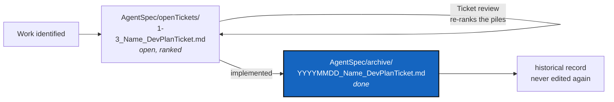

# Planning Ticket Lifecycle

*Created: 2026-09-03*

## Abstract — read this first

**The one-line version.** An open planning ticket is named for its
priority and its place in the queue — `1-3_Name_DevPlanTicket.md` — and
lives in `AgentSpec/openTickets/`. When its work is implemented, that
prefix is replaced by a `YYYYMMDD_` calendar stamp — the date the
implementation landed — and the file moves to `AgentSpec/archive/`.

**What this document is.** The naming and filing rules for planning
tickets: `DevPlan*.md`, `DevPlanTicket*.md`, `CorPlan*.md`, and anything
else that plans work rather than describing how the code works.

**Why it exists.** A ticket's filename is the only signal most readers
ever see. Without a rule, "is this still open?" can only be answered by
reading the whole document and then guessing, and "which one do I pick up
next?" can only be answered by reading all of them. Two prefixes answer
both from the filename alone, and neither can rot: one records a date that
already happened, the other is rewritten on purpose whenever the order
changes.

**What you will find.** Two states and the one transition between them,
the priority-and-rank prefix an open ticket carries, what the date stamp
means, the commit messages a finished ticket owes, and what the rule does
*not* cover.

**Who it is for.** Anyone — human or agent — who writes, ranks, or
finishes a ticket.

**What you need to do with it.** Give every new ticket a prefix when you
create it (§2). Stamp and move it as part of the commit that implements
it (§4), not as a later tidy-up, and deliver a commit message for every
repository that changed (§4.1).



---

## 1. The two states

| State | Where it lives | Filename |
|---|---|---|
| **Open** — planned, in progress, or partly done | `AgentSpec/openTickets/` | ranked: `<priority>-<rank>_<Name>_DevPlanTicket.md` |
| **Implemented** — the work described is done | `AgentSpec/archive/` | stamped: `<YYYYMMDD>_<Name>_DevPlanTicket.md` |

There is no third state. A ticket that turns out to be wrong, or that is
superseded by another, is archived the same way — the stamp records when
it stopped being live work, and the document itself says why.

`AgentSpec/` itself holds nothing but these two directories. A ticket
sitting loose at that level is a filing mistake, not a state.

## 2. The prefix an open ticket carries

```
AgentSpec/openTickets/<priority>-<rank>_<Name>_DevPlanTicket.md
```

**`<priority>` is `1` or `2`.** Nothing else is a valid priority.

| Priority | Meaning |
|---|---|
| `1` — **prioritary** | Work to pick up now. A red build, a data-loss path, a wrong answer the user acts on, or something explicitly asked for. |
| `2` — **stand-by** | Real work, correctly analysed, not now. Large designs, speculative proposals, and small polish that nothing is waiting on. |

**`<rank>` is the ticket's position in its own priority's pile**, counted
from 1. The two piles are numbered independently, so `1-4` and `2-4` both
exist; the priority digit decides between them first, and the rank only
orders tickets within one pile.

Counting per pile rather than across both is what keeps the rank short: a
pile must reach ten tickets before the rank needs two characters, and a
pile that long is itself the problem to fix. When it happens, `1-10` is
correct and needs no new rule.

### 2.1 How the numbers change

1. **On creation**, a ticket is appended to the end of its pile: its rank
   is that pile's current length plus one. Nothing is renumbered, and the
   author does not have to argue for a position.
2. **On a Ticket review**, both piles are re-ranked by priority and
   importance, tickets move between piles, and the ranks are compacted so
   each pile runs 1..N with no gaps. This is the only thing that changes a
   rank, and it is expected to happen often.

A rank is a current judgement, not a commitment or a delivery order. A
ticket ranked `2-5` is not bad work: `2` is a scheduling claim, not a
quality one.

### 2.2 Referring to a ticket from another document

Because ranks move, **name a ticket by its short name in prose** —
`AppendCloneMode`, not `1-2_AppendCloneMode_DevPlanTicket.md`. A ranked
filename written into running text is wrong at the next review, and
nothing will tell you.

Write the full ranked path only in an actual Markdown link, where a
reader clicks it and a broken one is visible. Those are the paths the
`grep` in §4 is there to catch.

## 3. What the stamp is

`YYYYMMDD`, no separators — the date the implementation landed.

It is **not** the date the ticket was written. That is the `*Created:
YYYY-MM-DD*` line under the title, which is set once at authoring time and
never rewritten (see [DOCSTYLE.md](DevSpec/DOCSTYLE.md) §6). An archived ticket
keeps that line: the two dates are different facts, and a ticket that was
planned in August and shipped in September should say so on both counts.

Neither date is ever edited afterwards. A stamped, archived ticket is a
historical record — if the work needs revisiting, that is a new ticket,
which may link back to this one.

## 4. The transition

In the same commit that finishes the work — the `<priority>-<rank>_`
prefix comes off, the stamp goes on:

```bash
git mv AgentSpec/openTickets/<priority>-<rank>_<Name>_DevPlanTicket.md \
       AgentSpec/archive/<YYYYMMDD>_<Name>_DevPlanTicket.md
```

Then fix any link that pointed at the old path (`grep -rn "<Name>_DevPlanTicket"`).

The rank is dropped rather than kept because it is a position among the
tickets that are *still open*. Once the work ships, that position has no
comparison set left to mean anything against.

Stamping is part of the implementing change, not a follow-up: a ticket
whose work has shipped but whose filename still says "open" is exactly
the wrong answer to the first question the filename is there to answer.

### 4.1 Deliver the commit messages

Finishing a ticket includes writing the commit message for **every
repository the change touched** — the project's own, and each mounted
configuration repository that changed. They are separate Git
repositories, they commit separately, and each one needs a message that
stands on its own.

Deliver them as text in the report that closes the ticket. A reader who
was away from the work should be able to read the message and know what
landed, without opening the diff.

Whether to commit is the owner's call unless the owner asks for it. A
repository that is private and read-only is a third case again: a push
there reaches every project that mounts it, so it is never bundled with
the project's own commit.

## 5. What this does not cover

Specs (a project's own `.localSpec/AdditionalSpecs.md`, the nested
`DevSpec/DevSpecs.md`, [DOCSTYLE.md](DevSpec/DOCSTYLE.md), this file), a
project's own `.localSpec/audit.md`, `README.md`, and the tutorials are
**living documents**, not tickets. They are edited in
place forever, are never ranked or stamped, and never move to `archive/`.
The test is simple: a ticket describes work to be done and stops being
true once it is done; a living document describes how things are and is
kept true.
